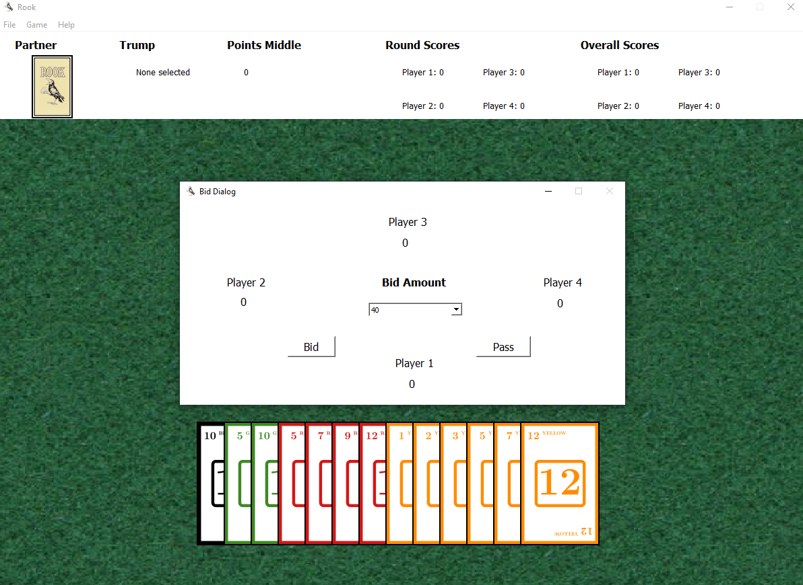

# Current Progress

## Things to do

1. Installer : Use the Qt installer framework. See [here](https://doc.qt.io/qtinstallerframework/ifw-overview.html).

## coding style

1. prefer stack to heap. for example,

class MyWidget : public QWidget

｛
  QLabel myLabel;
  QPushButton myButton;
❵;

is preferred to

class MyWidget : public QWidget
❴
  QLabel * myLabel;
  QPushButton * myButton;

❵;

2. This game allows user to change game resolution. To implement this scalable widget classes should be used in ScalableClasses and a rescale method for the class should be implemented which calls the rescale method for child classes. For example,

class MyScalableWidget 

